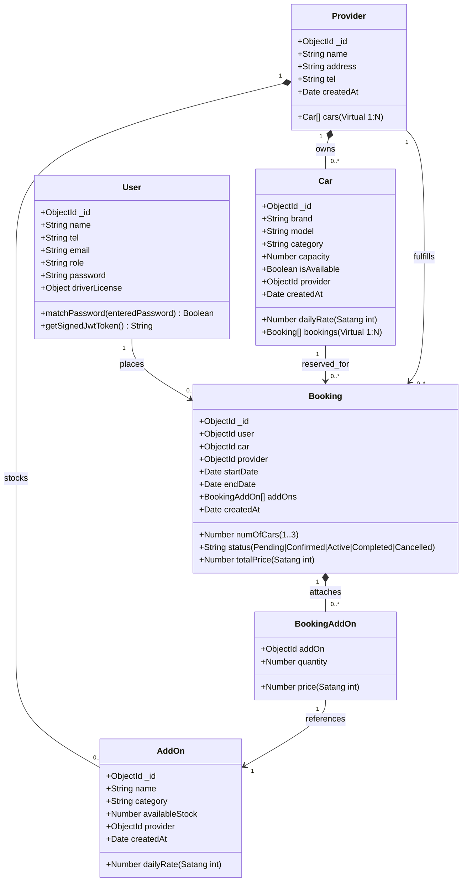

# Rental Car Booking Platform: UML Class Diagram

```mermaid
classDiagram
    direction TB

    class User {
        +ObjectId _id
        +String name
        +String tel
        +String email
        +String role
        +String password
        +Object driverLicense
        +matchPassword(enteredPassword) Boolean
        +getSignedJwtToken() String
    }

    class Provider {
        +ObjectId _id
        +String name
        +String address
        +String tel
        +Date createdAt
        +Car[] cars (Virtual 1:N)
    }

    class Car {
        +ObjectId _id
        +String brand
        +String model
        +String category
        +Number dailyRate (Satang int)
        +Number capacity
        +Boolean isAvailable
        +ObjectId provider
        +Date createdAt
        +Booking[] bookings (Virtual 1:N)
    }

    class Booking {
        +ObjectId _id
        +ObjectId user
        +ObjectId car
        +ObjectId provider
        +Date startDate
        +Date endDate
        +Number numOfCars (1..3)
        +String status (Pending|Confirmed|Active|Completed|Cancelled)
        +Number totalPrice (Satang int)
        +BookingAddOn[] addOns
        +Date createdAt
    }

    class AddOn {
        +ObjectId _id
        +String name
        +String category
        +Number dailyRate (Satang int)
        +Number availableStock
        +ObjectId provider
        +Date createdAt
    }

    class BookingAddOn {
        +ObjectId addOn
        +Number quantity
        +Number price (Satang int)
    }

    %% Relationships
    Provider "1" *-- "0..*" Car : owns
    Provider "1" *-- "0..*" AddOn : stocks
    User "1" --> "0..*" Booking : places
    Car "1" --> "0..*" Booking : reserved_for
    Provider "1" --> "0..*" Booking : fulfills
    Booking "1" *-- "0..*" BookingAddOn : attaches
    BookingAddOn "1" --> "1" AddOn : references
```
