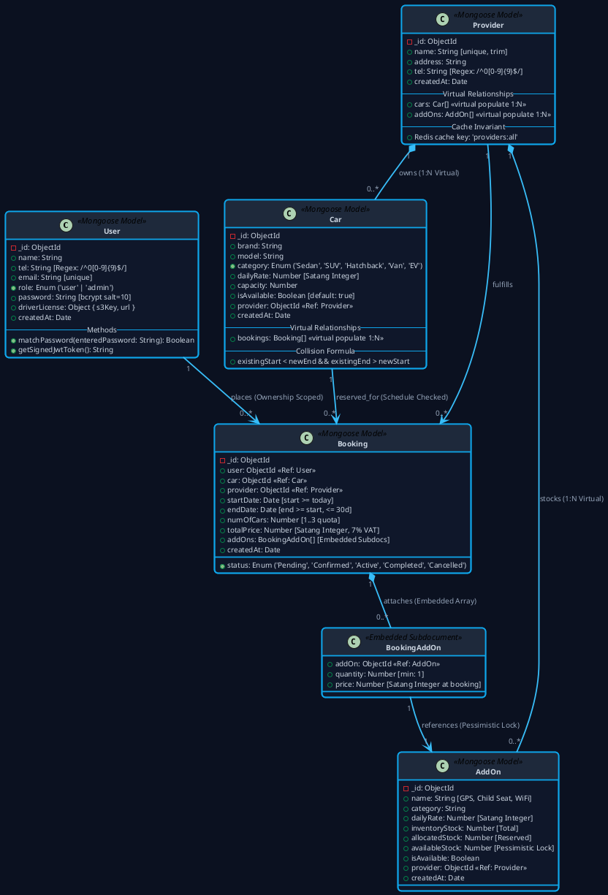

# Rental Car Booking Platform: UML Class Diagram

> **Rendered Asset Path**: `docs/diagrams/class_diagram.png` (Presentation Slide 7)  
> **PlantUML Source**: `docs/diagrams/class_diagram.puml`

```plantuml
@startuml class_diagram
skinparam BackgroundColor #0B1120
skinparam roundcorner 10
skinparam shadowing false
skinparam defaultFontName "Helvetica, Arial, sans-serif"
skinparam defaultFontSize 11

skinparam class {
    BackgroundColor #0F172A
    BorderColor #0EA5E9
    BorderThickness 1.8
    HeaderBackgroundColor #1E293B
    FontColor #F8FAFC
    FontSize 13
    FontStyle bold
    AttributeFontColor #CBD5E1
    AttributeFontSize 10
}

skinparam stereotypeCBackgroundColor #0284C7
skinparam stereotypeCFontColor #FFFFFF

skinparam arrow {
    Color #38BDF8
    Thickness 1.8
    FontColor #94A3B8
    FontSize 10
}

class User <<Mongoose Model>> {
    -_id: ObjectId
    +name: String
    +tel: String [Regex: /^0[0-9]{9}$/]
    +email: String [unique]
    +role: Enum ('user' | 'admin')
    +password: String [bcrypt salt=10]
    +driverLicense: Object { s3Key, url }
    +createdAt: Date
    -- Methods --
    +matchPassword(enteredPassword: String): Boolean
    +getSignedJwtToken(): String
}

class Provider <<Mongoose Model>> {
    -_id: ObjectId
    +name: String [unique, trim]
    +address: String
    +tel: String [Regex: /^0[0-9]{9}$/]
    +createdAt: Date
    -- Virtual Relationships --
    +cars: Car[] <<virtual populate 1:N>>
    +addOns: AddOn[] <<virtual populate 1:N>>
    -- Cache Invariant --
    +Redis cache key: 'providers:all'
}

class Car <<Mongoose Model>> {
    -_id: ObjectId
    +brand: String
    +model: String
    +category: Enum ('Sedan', 'SUV', 'Hatchback', 'Van', 'EV')
    +dailyRate: Number [Satang Integer]
    +capacity: Number
    +isAvailable: Boolean [default: true]
    +provider: ObjectId <<Ref: Provider>>
    +createdAt: Date
    -- Virtual Relationships --
    +bookings: Booking[] <<virtual populate 1:N>>
    -- Collision Formula --
    +existingStart < newEnd && existingEnd > newStart
}

class Booking <<Mongoose Model>> {
    -_id: ObjectId
    +user: ObjectId <<Ref: User>>
    +car: ObjectId <<Ref: Car>>
    +provider: ObjectId <<Ref: Provider>>
    +startDate: Date [start >= today]
    +endDate: Date [end >= start, <= 30d]
    +numOfCars: Number [1..3 quota]
    +status: Enum ('Pending', 'Confirmed', 'Active', 'Completed', 'Cancelled')
    +totalPrice: Number [Satang Integer, 7% VAT]
    +addOns: BookingAddOn[] [Embedded Subdocs]
    +createdAt: Date
}

class AddOn <<Mongoose Model>> {
    -_id: ObjectId
    +name: String [GPS, Child Seat, WiFi]
    +category: String
    +dailyRate: Number [Satang Integer]
    +inventoryStock: Number [Total]
    +allocatedStock: Number [Reserved]
    +availableStock: Number [Pessimistic Lock]
    +isAvailable: Boolean
    +provider: ObjectId <<Ref: Provider>>
    +createdAt: Date
}

class BookingAddOn <<Embedded Subdocument>> {
    +addOn: ObjectId <<Ref: AddOn>>
    +quantity: Number [min: 1]
    +price: Number [Satang Integer at booking]
}

' Entity Relationships
Provider "1" *-- "0..*" Car : owns (1:N Virtual)
Provider "1" *-- "0..*" AddOn : stocks (1:N Virtual)
User "1" --> "0..*" Booking : places (Ownership Scoped)
Car "1" --> "0..*" Booking : reserved_for (Schedule Checked)
Provider "1" --> "0..*" Booking : fulfills
Booking "1" *-- "0..*" BookingAddOn : attaches (Embedded Array)
BookingAddOn "1" --> "1" AddOn : references (Pessimistic Lock)

@enduml
```
