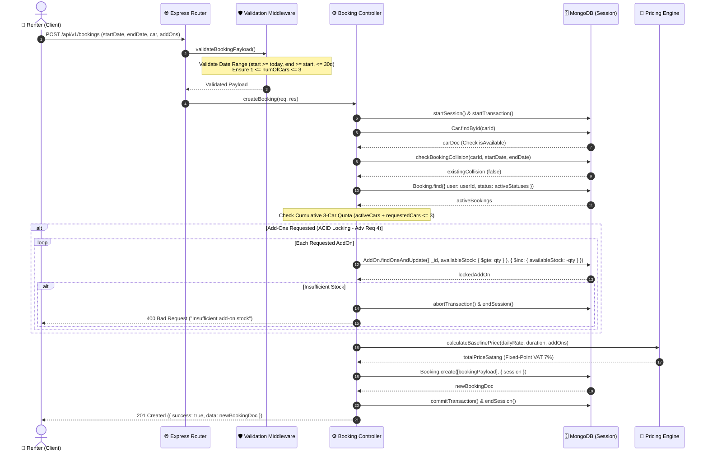

# Rental Car Booking Platform: Sequence Diagram

```mermaid
sequenceDiagram
    autonumber
    actor User as 👤 Renter (Client)
    participant Router as 🌐 Express Router
    participant Val as 🛡️ Validation Middleware
    participant Ctrl as ⚙️ Booking Controller
    participant MDB as 🗄️ MongoDB (Session)
    participant Pricing as 🧮 Pricing Engine

    User->>Router: POST /api/v1/bookings (startDate, endDate, car, addOns)
    Router->>Val: validateBookingPayload()
    Note over Val: Validate Date Range (start >= today, end >= start, <= 30d)<br/>Ensure 1 <= numOfCars <= 3
    Val-->>Router: Validated Payload

    Router->>Ctrl: createBooking(req, res)
    Ctrl->>MDB: startSession() & startTransaction()

    Ctrl->>MDB: Car.findById(carId)
    MDB-->>Ctrl: carDoc (Check isAvailable)

    Ctrl->>MDB: checkBookingCollision(carId, startDate, endDate)
    MDB-->>Ctrl: existingCollision (false)

    Ctrl->>MDB: Booking.find({ user: userId, status: activeStatuses })
    MDB-->>Ctrl: activeBookings
    Note over Ctrl: Check Cumulative 3-Car Quota (activeCars + requestedCars <= 3)

    alt Add-Ons Requested (ACID Locking - Adv Req 4)
        loop Each Requested AddOn
            Ctrl->>MDB: AddOn.findOneAndUpdate({ _id, availableStock: { $gte: qty } }, { $inc: { availableStock: -qty } })
            MDB-->>Ctrl: lockedAddOn
            alt Insufficient Stock
                Ctrl->>MDB: abortTransaction() & endSession()
                Ctrl-->>User: 400 Bad Request ("Insufficient add-on stock")
            end
        end
    end

    Ctrl->>Pricing: calculateBaselinePrice(dailyRate, duration, addOns)
    Pricing-->>Ctrl: totalPriceSatang (Fixed-Point VAT 7%)

    Ctrl->>MDB: Booking.create([bookingPayload], { session })
    MDB-->>Ctrl: newBookingDoc

    Ctrl->>MDB: commitTransaction() & endSession()
    Ctrl-->>User: 201 Created ({ success: true, data: newBookingDoc })
```
