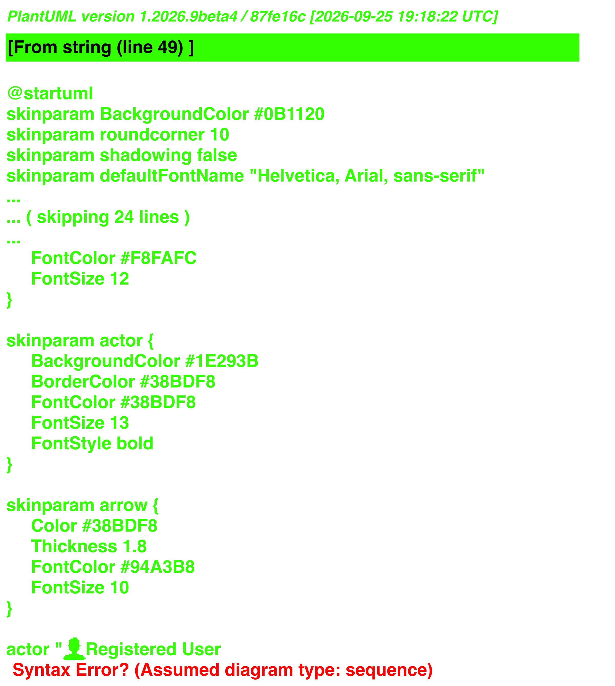
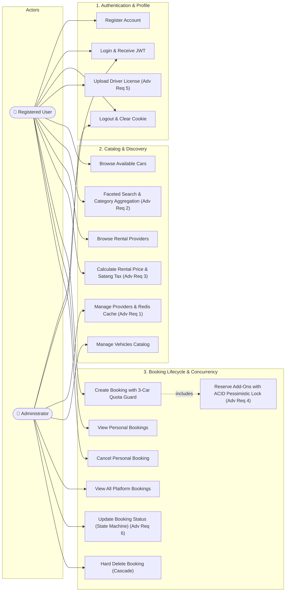

# Rental Car Booking Platform: Use Case Diagram

```mermaid
flowchart LR
    subgraph Actors
        User(["👤 Registered User"])
        Admin(["👮 Administrator"])
    end

    subgraph AuthManagement["1. Authentication & Profile"]
        UC_Reg["Register Account"]
        UC_Login["Login & Receive JWT"]
        UC_Logout["Logout & Clear Cookie"]
        UC_UploadDoc["Upload Driver License (Adv Req 5)"]
    end

    subgraph CatalogManagement["2. Catalog & Discovery"]
        UC_ViewCars["Browse Available Cars"]
        UC_SearchFacet["Faceted Search & Category Aggregation (Adv Req 2)"]
        UC_ViewProviders["Browse Rental Providers"]
        UC_CalcPrice["Calculate Rental Price & Satang Tax (Adv Req 3)"]
        UC_ManageProviders["Manage Providers & Redis Cache (Adv Req 1)"]
        UC_ManageCars["Manage Vehicles Catalog"]
    end

    subgraph BookingManagement["3. Booking Lifecycle & Concurrency"]
        UC_CreateBooking["Create Booking with 3-Car Quota Guard"]
        UC_LockAddon["Reserve Add-Ons with ACID Pessimistic Lock (Adv Req 4)"]
        UC_ViewOwn["View Personal Bookings"]
        UC_CancelOwn["Cancel Personal Booking"]
        UC_ViewAll["View All Platform Bookings"]
        UC_UpdateStatus["Update Booking Status (State Machine) (Adv Req 6)"]
        UC_DeleteBooking["Hard Delete Booking (Cascade)"]
    end

    %% User Connections
    User --> UC_Reg
    User --> UC_Login
    User --> UC_Logout
    User --> UC_UploadDoc
    User --> UC_ViewCars
    User --> UC_SearchFacet
    User --> UC_ViewProviders
    User --> UC_CalcPrice
    User --> UC_CreateBooking
    User --> UC_ViewOwn
    User --> UC_CancelOwn

    UC_CreateBooking -.->|includes| UC_LockAddon

    %% Admin Connections
    Admin --> UC_Login
    Admin --> UC_Logout
    Admin --> UC_ManageProviders
    Admin --> UC_ManageCars
    Admin --> UC_ViewAll
    Admin --> UC_UpdateStatus
    Admin --> UC_DeleteBooking
```
